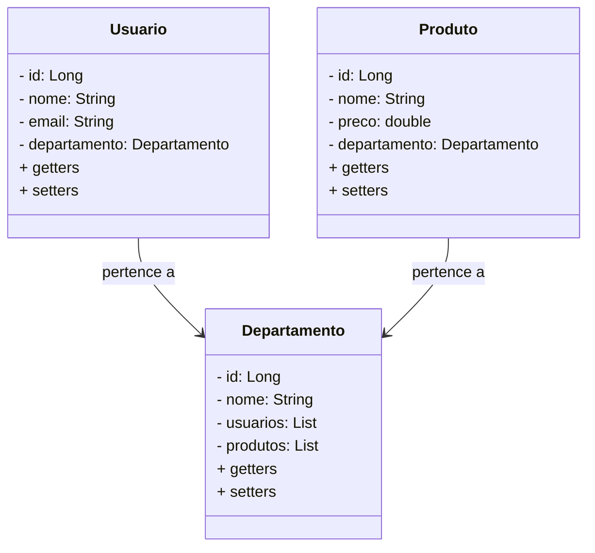

# Santander-Dev-week-2023-Project
Projeto Java API de Usuários, Departamentos e Produtos para o DIO Santander Dev Week - 2023

```mermaid
classDiagram
  class Usuario {
    - id: Long
    - nome: String
    - email: String
    - departamento: Departamento
    + getters
    + setters
  }
  
  class Departamento {
    - id: Long
    - nome: String
    - usuarios: List<Usuario>
    - produtos: List<Produto>
    + getters
    + setters
  }

  class Produto {
    - id: Long
    - nome: String
    - preco: double
    - departamento: Departamento
    + getters
    + setters
  }

  Usuario --> Departamento : pertence a
  Produto --> Departamento : pertence a
```
